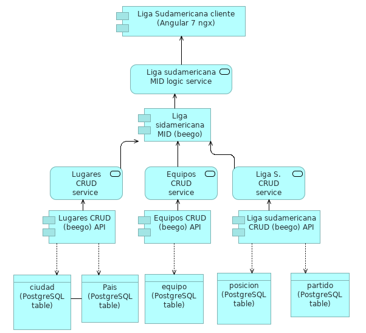
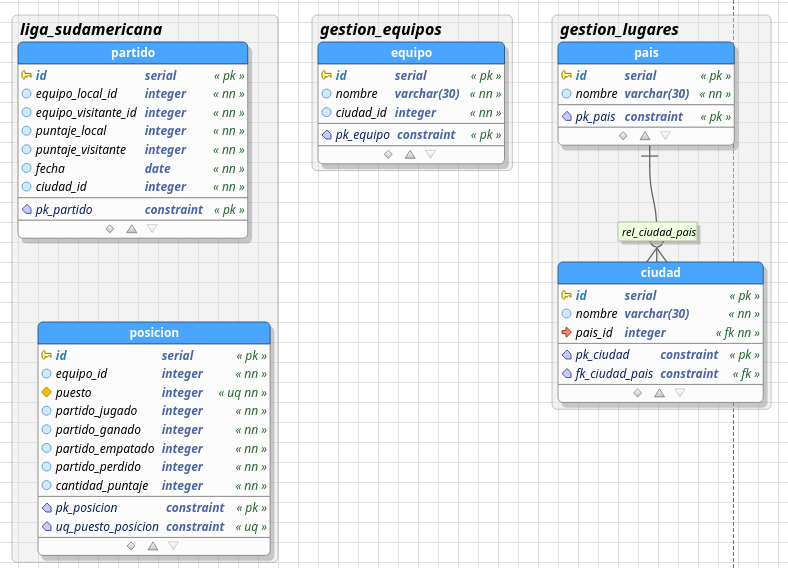

# Liga sudamericana CRUD

API CRUD del proyecto para prueba de gestion de liga sudamericana de la oficina asesora de sistemas

- este proyecto hace parte del CRUD de la siguiente arquitectura de aplicaciones:



- implementa el API CRUD para las tablas del esquema liga_sudamericana de la base de datos


- Para desplegar el API es necesario:
- tener la base de datos creada
- Tener instalado GO y beego




- luego se ejecuta el comando: 

```
 bee run 
```

- para generar documentacion con swagger

```
 bee run -downdoc=true -gendoc=true 
```

- [Licencia](LICENSE)